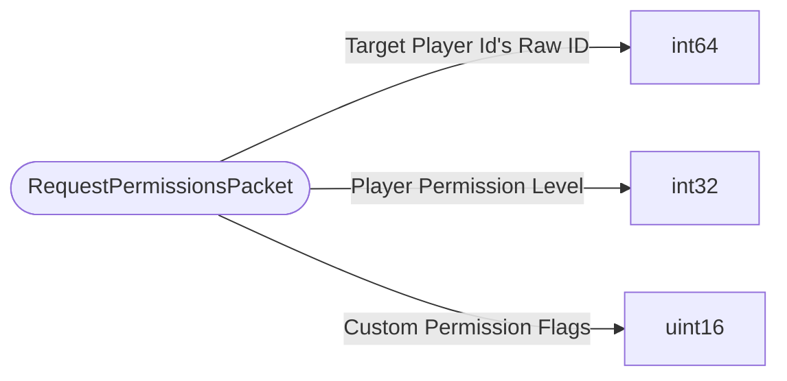

# RequestPermissionsPacket

`packet` - id **185**

- protocol: 2168
- minecraft: 1.26.40

Can only be used by Operators or Hosts.

```mermaid
flowchart LR
  ROOT(["RequestPermissionsPacket"])
  ROOT -->|"Target Player Id's Raw ID"| int64["int64"]
  ROOT -->|"Player Permission Level"| int32["int32"]
  ROOT -->|"Custom Permission Flags"| uint16["uint16"]
```

