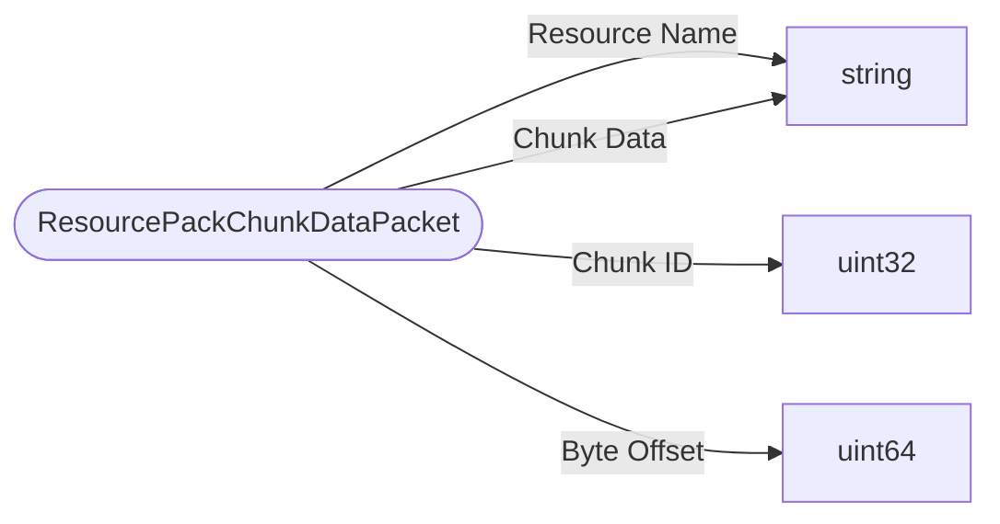

# ResourcePackChunkDataPacket

`packet` - id **83**

- protocol: 2168
- minecraft: 1.26.40

(only one marked for uncompressed) realms resource pack download

```mermaid
flowchart LR
  ROOT(["ResourcePackChunkDataPacket"])
  ROOT -->|"Resource Name"| string["string"]
  ROOT -->|"Chunk ID"| uint32["uint32"]
  ROOT -->|"Byte Offset"| uint64["uint64"]
  ROOT -->|"Chunk Data"| string["string"]
```

