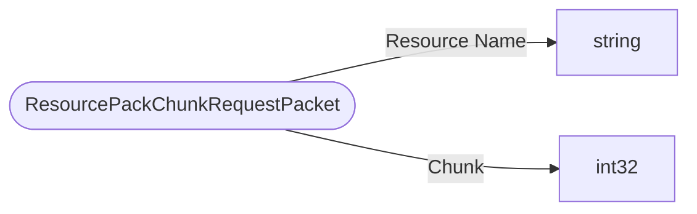

# ResourcePackChunkRequestPacket

`packet` - id **84**

```mermaid
flowchart LR
  ROOT(["ResourcePackChunkRequestPacket"])
  ROOT -->|"Resource Name"| string["string"]
  ROOT -->|"Chunk"| int32["int32"]
```

