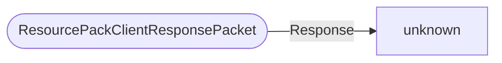

# ResourcePackClientResponsePacket

`packet` - id **8**

Sent to MinecraftGame to complete the resource pack loading process.

```mermaid
flowchart LR
  ROOT(["ResourcePackClientResponsePacket"])
  ROOT -->|"Response"| unknown["unknown"]
```

