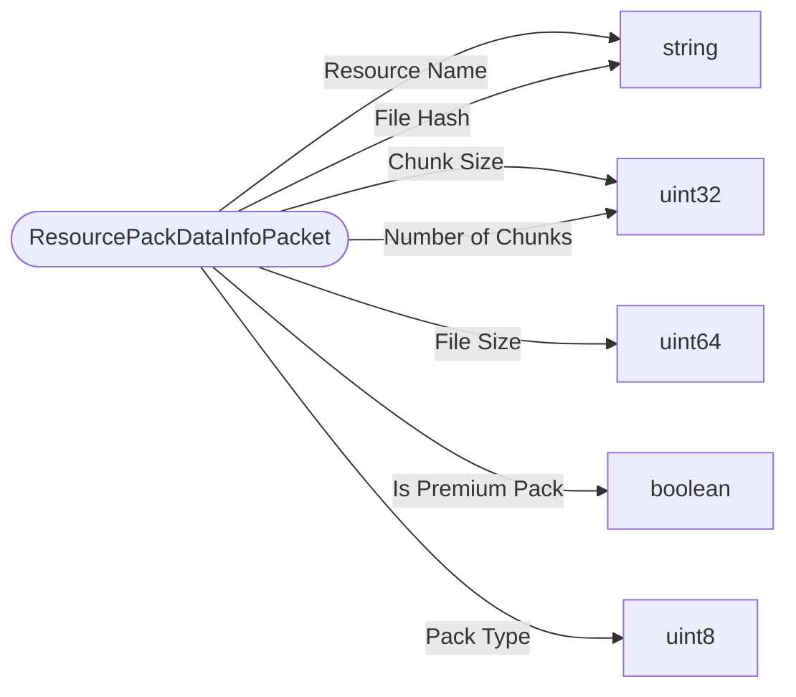

# ResourcePackDataInfoPacket

`packet` - id **82**

Sent from the serverFileChunkUploader during the initialization of the file uploader. This packet is sent to the primary client.

```mermaid
flowchart LR
  ROOT(["ResourcePackDataInfoPacket"])
  ROOT -->|"Resource Name"| string["string"]
  ROOT -->|"Chunk Size"| uint32["uint32"]
  ROOT -->|"Number of Chunks"| uint32["uint32"]
  ROOT -->|"File Size"| uint64["uint64"]
  ROOT -->|"File Hash"| string["string"]
  ROOT -->|"Is Premium Pack"| boolean["boolean"]
  ROOT -->|"Pack Type"| uint8["uint8"]
```

