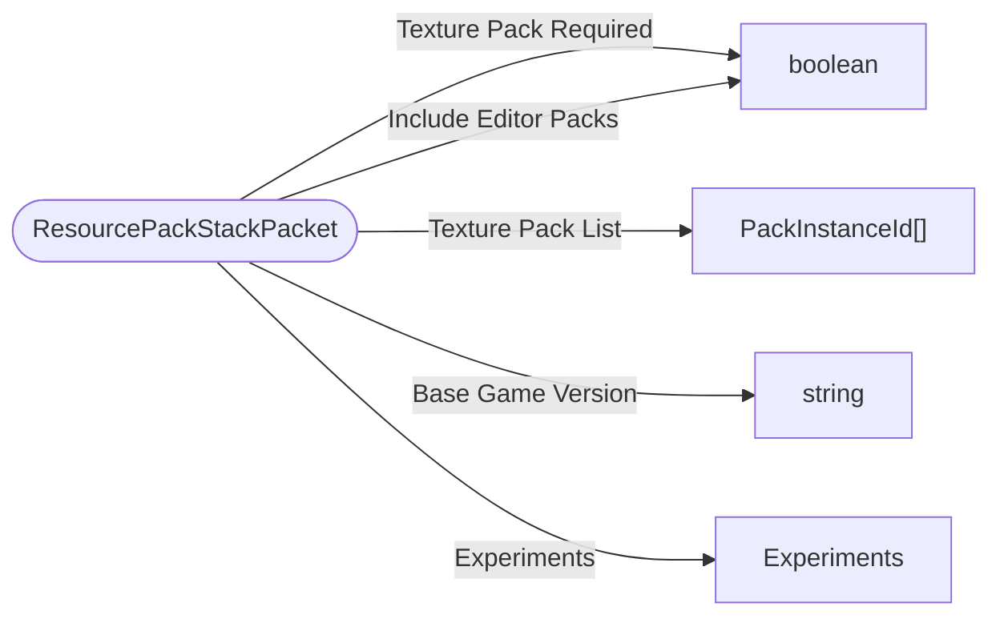

# ResourcePackStackPacket

`packet` - id **7**

Sent to client in response to ResourcePackClientResponsePacket with info on current resource pack stack.

```mermaid
flowchart LR
  ROOT(["ResourcePackStackPacket"])
  ROOT -->|"Texture Pack Required"| boolean["boolean"]
  ROOT -->|"Texture Pack List"| PackInstanceId["PackInstanceId[]"]
  ROOT -->|"Base Game Version"| string["string"]
  ROOT -->|"Experiments"| Experiments["Experiments"]
  ROOT -->|"Include Editor Packs"| boolean["boolean"]
```

