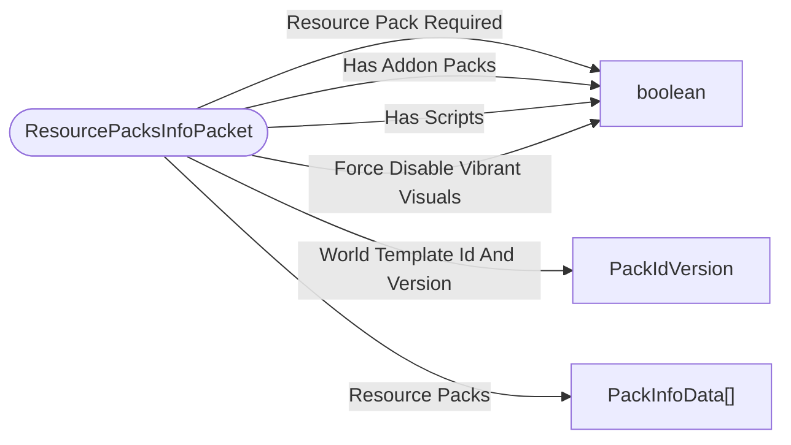

# ResourcePacksInfoPacket

`packet` - id **6**

- protocol: 2168
- minecraft: 1.26.40

Sends resource pack information to the client including pack IDs, versions, sizes, and content keys.

```mermaid
flowchart LR
  ROOT(["ResourcePacksInfoPacket"])
  ROOT -->|"Resource Pack Required"| boolean["boolean"]
  ROOT -->|"Has Addon Packs"| boolean["boolean"]
  ROOT -->|"Has Scripts"| boolean["boolean"]
  ROOT -->|"Force Disable Vibrant Visuals"| boolean["boolean"]
  ROOT -->|"World Template Id And Version"| PackIdVersion["PackIdVersion"]
  ROOT -->|"Resource Packs"| PackInfoData["PackInfoData[]"]
```

