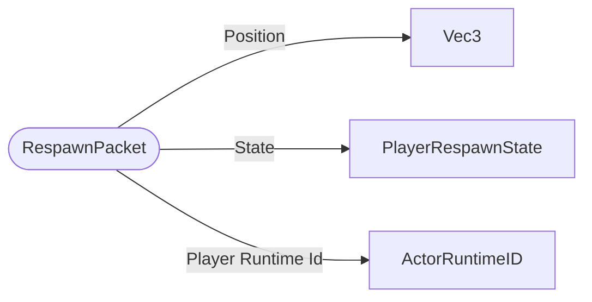

# RespawnPacket

`packet` - id **45**

- protocol: 2168
- minecraft: 1.26.40

For some reason each respawn 1 packet is sent from the client and 3 are sent from the server.

```mermaid
flowchart LR
  ROOT(["RespawnPacket"])
  ROOT -->|"Position"| Vec3["Vec3"]
  ROOT -->|"State"| PlayerRespawnState["PlayerRespawnState"]
  ROOT -->|"Player Runtime Id"| ActorRuntimeID["ActorRuntimeID"]
```

