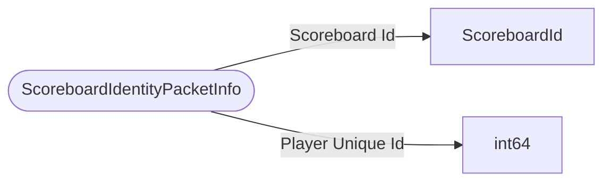

# ScoreboardIdentityPacketInfo

`packet`

```mermaid
flowchart LR
  ROOT(["ScoreboardIdentityPacketInfo"])
  ROOT -->|"Scoreboard Id"| ScoreboardId["ScoreboardId"]
  ROOT -->|"Player Unique Id"| int64["int64"]
```

