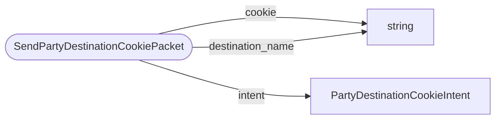

# SendPartyDestinationCookiePacket

`packet` - id **349**

- protocol: 2168
- minecraft: 1.26.40

```mermaid
flowchart LR
  ROOT(["SendPartyDestinationCookiePacket"])
  ROOT -->|"cookie"| string["string"]
  ROOT -->|"intent"| PartyDestinationCookieIntent["PartyDestinationCookieIntent"]
  ROOT -->|"destination_name"| string["string"]
```

