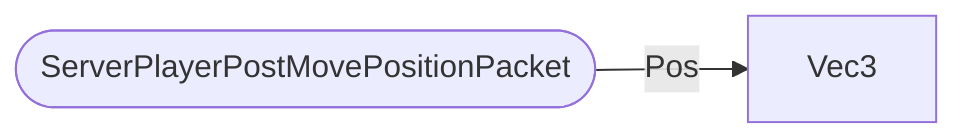

# ServerPlayerPostMovePositionPacket

`packet` - id **16**

Is currently only used for debug draw. Packets will not be sent if debug draw is not available.

```mermaid
flowchart LR
  ROOT(["ServerPlayerPostMovePositionPacket"])
  ROOT -->|"Pos"| Vec3["Vec3"]
```

