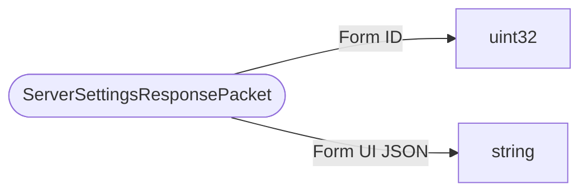

# ServerSettingsResponsePacket

`packet` - id **103**

```mermaid
flowchart LR
  ROOT(["ServerSettingsResponsePacket"])
  ROOT -->|"Form ID"| uint32["uint32"]
  ROOT -->|"Form UI JSON"| string["string"]
```

