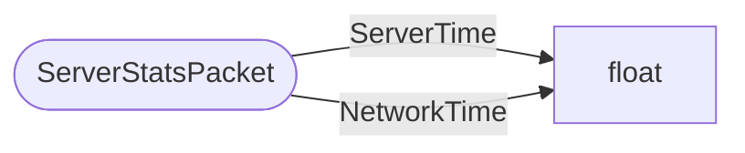

# ServerStatsPacket

`packet` - id **192**

Sent from server.

```mermaid
flowchart LR
  ROOT(["ServerStatsPacket"])
  ROOT -->|"ServerTime"| float["float"]
  ROOT -->|"NetworkTime"| float["float"]
```

