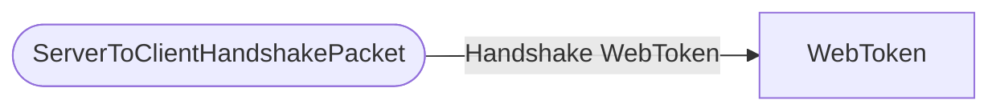

# ServerToClientHandshakePacket

`packet` - id **3**

Sent from the server at the end of the login packet

```mermaid
flowchart LR
  ROOT(["ServerToClientHandshakePacket"])
  ROOT -->|"Handshake WebToken"| WebToken["WebToken"]
```

