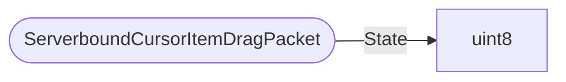

# ServerboundCursorItemDragPacket

`packet` - id **358**

Sent from the client when a cursor item split drag starts or stops.

```mermaid
flowchart LR
  ROOT(["ServerboundCursorItemDragPacket"])
  ROOT -->|"State"| uint8["uint8"]
```

