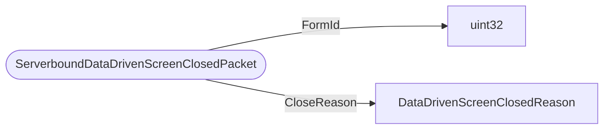

# ServerboundDataDrivenScreenClosedPacket

`packet` - id **343**

```mermaid
flowchart LR
  ROOT(["ServerboundDataDrivenScreenClosedPacket"])
  ROOT -->|"FormId"| uint32["uint32"]
  ROOT -->|"CloseReason"| DataDrivenScreenClosedReason["DataDrivenScreenClosedReason"]
```

