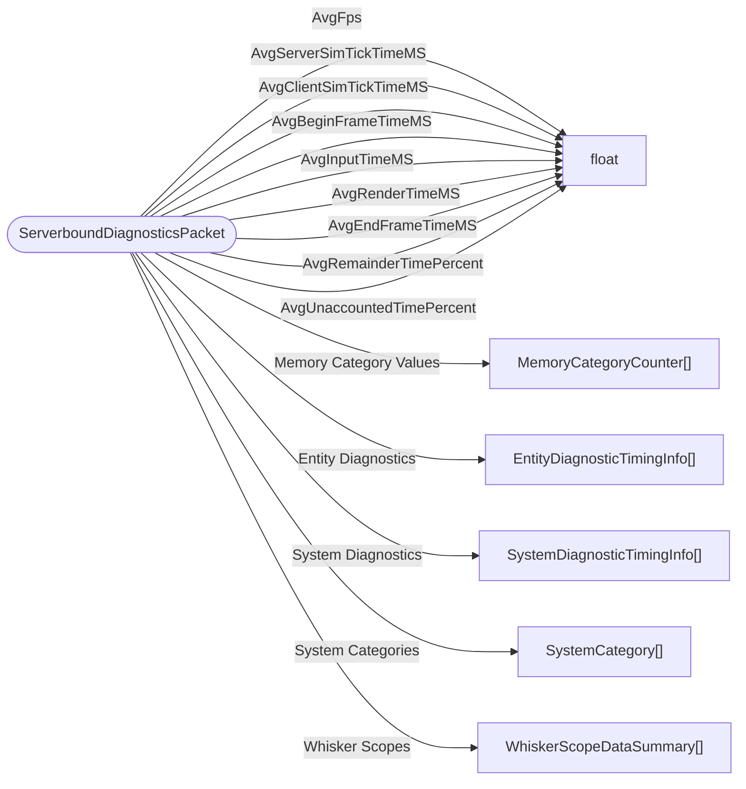

# ServerboundDiagnosticsPacket

`packet` - id **315**

- protocol: 2168
- minecraft: 1.26.40

```mermaid
flowchart LR
  ROOT(["ServerboundDiagnosticsPacket"])
  ROOT -->|"AvgFps"| float["float"]
  ROOT -->|"AvgServerSimTickTimeMS"| float["float"]
  ROOT -->|"AvgClientSimTickTimeMS"| float["float"]
  ROOT -->|"AvgBeginFrameTimeMS"| float["float"]
  ROOT -->|"AvgInputTimeMS"| float["float"]
  ROOT -->|"AvgRenderTimeMS"| float["float"]
  ROOT -->|"AvgEndFrameTimeMS"| float["float"]
  ROOT -->|"AvgRemainderTimePercent"| float["float"]
  ROOT -->|"AvgUnaccountedTimePercent"| float["float"]
  ROOT -->|"Memory Category Values"| MemoryCategoryCounter["MemoryCategoryCounter[]"]
  ROOT -->|"Entity Diagnostics"| EntityDiagnosticTimingInfo["EntityDiagnosticTimingInfo[]"]
  ROOT -->|"System Diagnostics"| SystemDiagnosticTimingInfo["SystemDiagnosticTimingInfo[]"]
  ROOT -->|"System Categories"| SystemCategory["SystemCategory[]"]
  ROOT -->|"Whisker Scopes"| WhiskerScopeDataSummary["WhiskerScopeDataSummary[]"]
```

