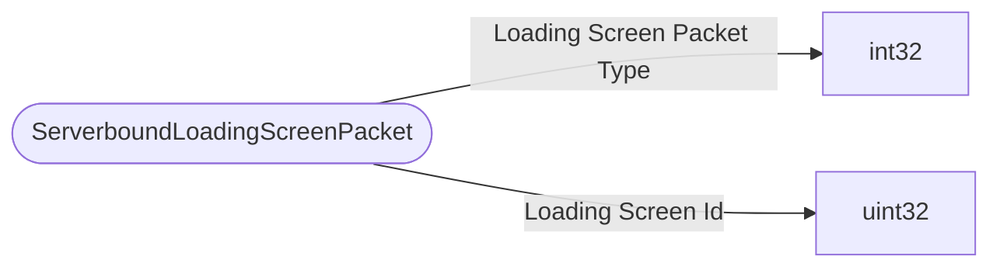

# ServerboundLoadingScreenPacket

`packet` - id **312**

- protocol: 2168
- minecraft: 1.26.40

In order for the client to send a packet with StartLoadingScreen, the server needs to anticipate that this packet is coming.
If the server doesn't expect that we are about to start a loading screen, the server will disconnect the client.
EndLoadingScreen is sent by the client when the loading screen closes.
The Loading Screen Id field will be empty if the loading screen is triggered by the initial loading into of a world.
The Loading Screen Id field will have a value if sent by the server. This currently happens as part of ChangeDimensionPacket if the player is alive.

