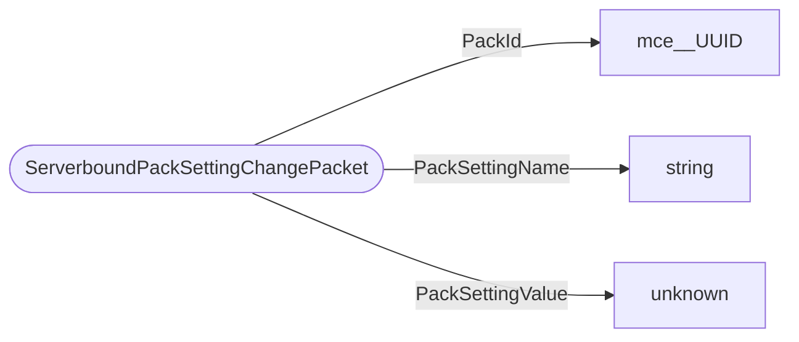

# ServerboundPackSettingChangePacket

`packet` - id **329**

```mermaid
flowchart LR
  ROOT(["ServerboundPackSettingChangePacket"])
  ROOT -->|"PackId"| mce__UUID["mce__UUID"]
  ROOT -->|"PackSettingName"| string["string"]
  ROOT -->|"PackSettingValue"| unknown["unknown"]
```

