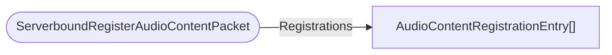

# ServerboundRegisterAudioContentPacket

`packet` - id **360**

```mermaid
flowchart LR
  ROOT(["ServerboundRegisterAudioContentPacket"])
  ROOT -->|"Registrations"| AudioContentRegistrationEntry["AudioContentRegistrationEntry[]"]
```

