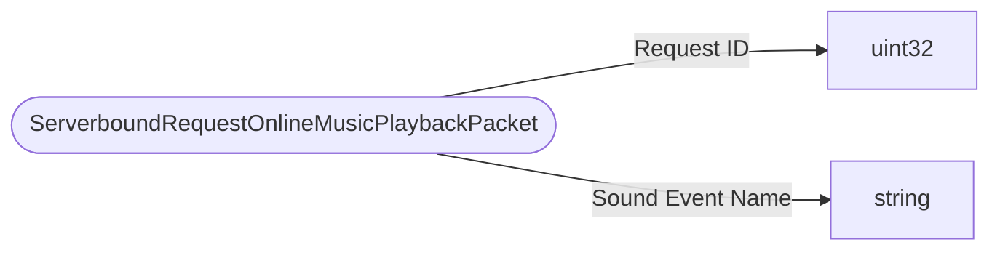

# ServerboundRequestOnlineMusicPlaybackPacket

`packet` - id **362**

```mermaid
flowchart LR
  ROOT(["ServerboundRequestOnlineMusicPlaybackPacket"])
  ROOT -->|"Request ID"| uint32["uint32"]
  ROOT -->|"Sound Event Name"| string["string"]
```

