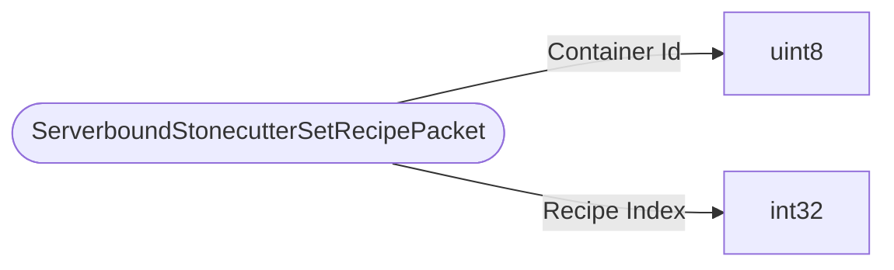

# ServerboundStonecutterSetRecipePacket

`packet` - id **354**

```mermaid
flowchart LR
  ROOT(["ServerboundStonecutterSetRecipePacket"])
  ROOT -->|"Container Id"| uint8["uint8"]
  ROOT -->|"Recipe Index"| int32["int32"]
```

