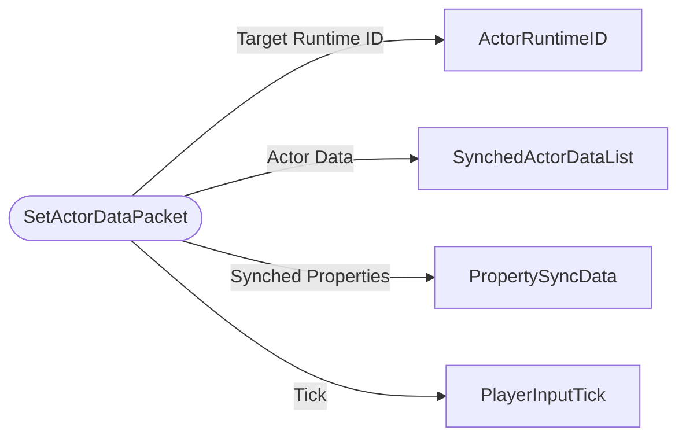

# SetActorDataPacket

`packet` - id **39**

- protocol: 2168
- minecraft: 1.26.40

```mermaid
flowchart LR
  ROOT(["SetActorDataPacket"])
  ROOT -->|"Target Runtime ID"| ActorRuntimeID["ActorRuntimeID"]
  ROOT -->|"Actor Data"| SynchedActorDataList["SynchedActorDataList"]
  ROOT -->|"Synched Properties"| PropertySyncData["PropertySyncData"]
  ROOT -->|"Tick"| PlayerInputTick["PlayerInputTick"]
```

