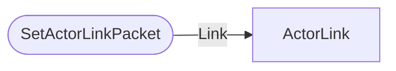

# SetActorLinkPacket

`packet` - id **41**

- protocol: 2168
- minecraft: 1.26.40

Sent when the player starts riding something. Two are sent at a time for some reason.

```mermaid
flowchart LR
  ROOT(["SetActorLinkPacket"])
  ROOT -->|"Link"| ActorLink["ActorLink"]
```

