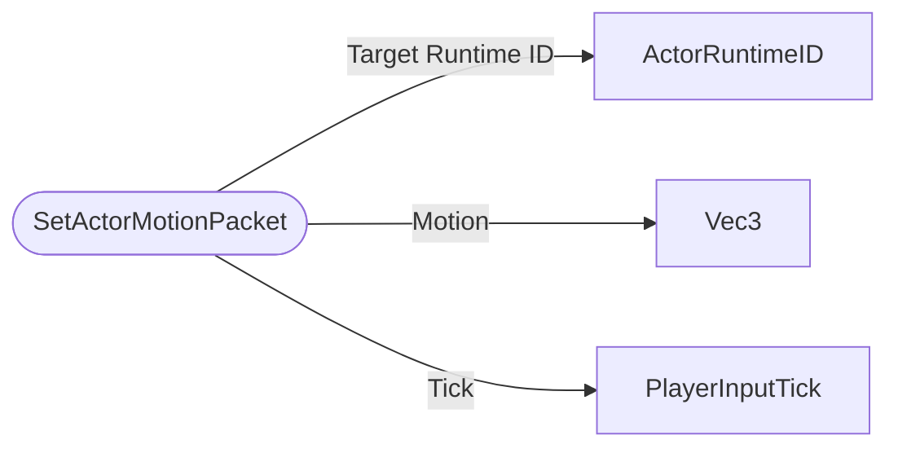

# SetActorMotionPacket

`packet` - id **40**

	It is primarily relevant for client predicted entities like the player or a boat or horse they are in control of.
	For most other actor types it does nothing. 
	This is one of the packets that can directly affect player motion, for others, see: 
	- MovePlayerPacket 
	- CorrectPlayerMovePredictionPacket
	

