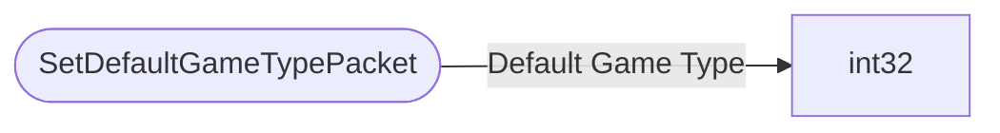

# SetDefaultGameTypePacket

`packet` - id **105**

- protocol: 2168
- minecraft: 1.26.40

```mermaid
flowchart LR
  ROOT(["SetDefaultGameTypePacket"])
  ROOT -->|"Default Game Type"| int32["int32"]
```

