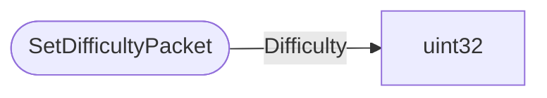

# SetDifficultyPacket

`packet` - id **60**

Used for when a client changes difficulty through the menu or when the server changes the difficulty.

```mermaid
flowchart LR
  ROOT(["SetDifficultyPacket"])
  ROOT -->|"Difficulty"| uint32["uint32"]
```

