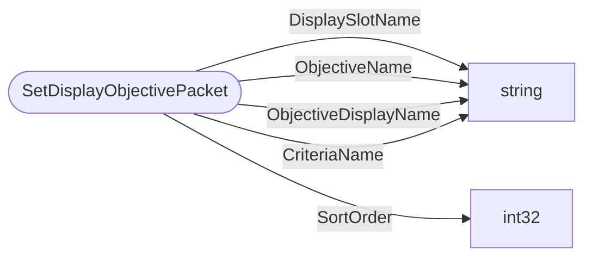

# SetDisplayObjectivePacket

`packet` - id **107**

- protocol: 2168
- minecraft: 1.26.40

```mermaid
flowchart LR
  ROOT(["SetDisplayObjectivePacket"])
  ROOT -->|"DisplaySlotName"| string["string"]
  ROOT -->|"ObjectiveName"| string["string"]
  ROOT -->|"ObjectiveDisplayName"| string["string"]
  ROOT -->|"CriteriaName"| string["string"]
  ROOT -->|"SortOrder"| int32["int32"]
```

