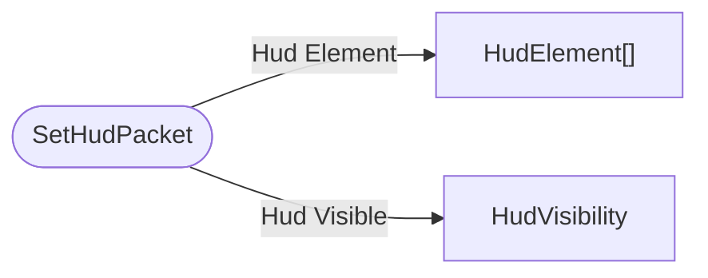

# SetHudPacket

`packet` - id **308**

- protocol: 2168
- minecraft: 1.26.40

This packet will toggle the HUD visibility.

```mermaid
flowchart LR
  ROOT(["SetHudPacket"])
  ROOT -->|"Hud Element"| HudElement["HudElement[]"]
  ROOT -->|"Hud Visible"| HudVisibility["HudVisibility"]
```

