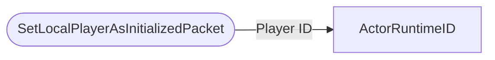

# SetLocalPlayerAsInitializedPacket

`packet` - id **113**

Client tells the server that the client is ready to roll.

```mermaid
flowchart LR
  ROOT(["SetLocalPlayerAsInitializedPacket"])
  ROOT -->|"Player ID"| ActorRuntimeID["ActorRuntimeID"]
```

