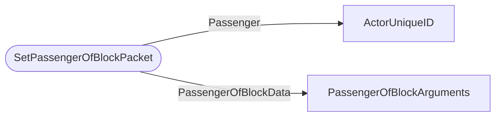

# SetPassengerOfBlockPacket

`packet` - id **357**

Sent when an actor starts or stops riding a block.

```mermaid
flowchart LR
  ROOT(["SetPassengerOfBlockPacket"])
  ROOT -->|"Passenger"| ActorUniqueID["ActorUniqueID"]
  ROOT -->|"PassengerOfBlockData"| PassengerOfBlockArguments["PassengerOfBlockArguments"]
```

