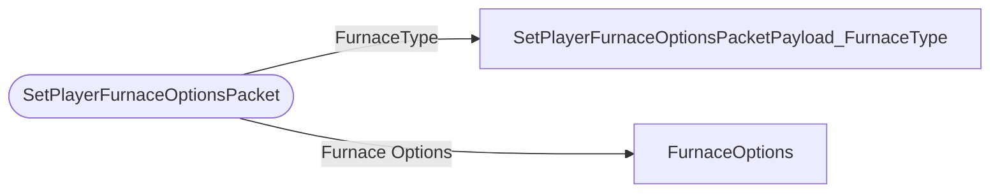

# SetPlayerFurnaceOptionsPacket

`packet` - id **351**

```mermaid
flowchart LR
  ROOT(["SetPlayerFurnaceOptionsPacket"])
  ROOT -->|"FurnaceType"| SetPlayerFurnaceOptionsPacketPayload_FurnaceType["SetPlayerFurnaceOptionsPacketPayload_FurnaceType"]
  ROOT -->|"Furnace Options"| FurnaceOptions["FurnaceOptions"]
```

