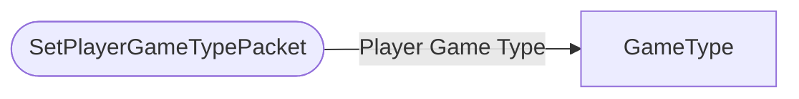

# SetPlayerGameTypePacket

`packet` - id **62**

The client handles the change of the UI element (the gametype dropdown, although this can be avoided by changing via command or on the server), then the client sends a packet to the server, then the server changes the player's gametype and sends a packet back (UpdatePlayerGameTypePacket) to make sure it matches on the client.

