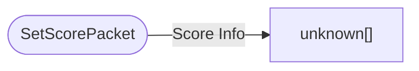

# SetScorePacket

`packet` - id **108**

- protocol: 2168
- minecraft: 1.26.40

Sets the scoreboard which is used for 3rd party content.

```mermaid
flowchart LR
  ROOT(["SetScorePacket"])
  ROOT -->|"Score Info"| unknown["unknown[]"]
```

