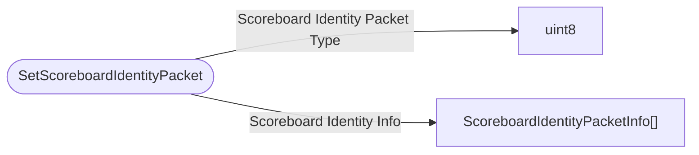

# SetScoreboardIdentityPacket

`packet` - id **112**

Send an update packet for a player identity definition iff a tracked player has logged in with a different display name.

```mermaid
flowchart LR
  ROOT(["SetScoreboardIdentityPacket"])
  ROOT -->|"Scoreboard Identity Packet Type"| uint8["uint8"]
  ROOT -->|"Scoreboard Identity Info"| ScoreboardIdentityPacketInfo["ScoreboardIdentityPacketInfo[]"]
```

