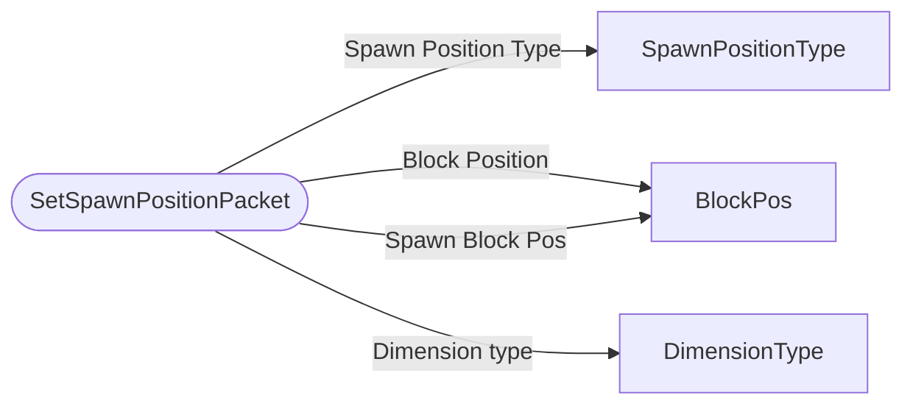

# SetSpawnPositionPacket

`packet` - id **43**

see RespawnPacket

```mermaid
flowchart LR
  ROOT(["SetSpawnPositionPacket"])
  ROOT -->|"Spawn Position Type"| SpawnPositionType["SpawnPositionType"]
  ROOT -->|"Block Position"| BlockPos["BlockPos"]
  ROOT -->|"Dimension type"| DimensionType["DimensionType"]
  ROOT -->|"Spawn Block Pos"| BlockPos["BlockPos"]
```

