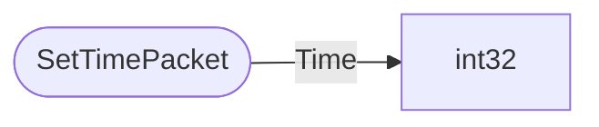

# SetTimePacket

`packet` - id **10**

Every so often (and at login) the server sends the current time to the client, and additionally the client can set the server time through 2 commands: DayLockCommand and TimeCommand

