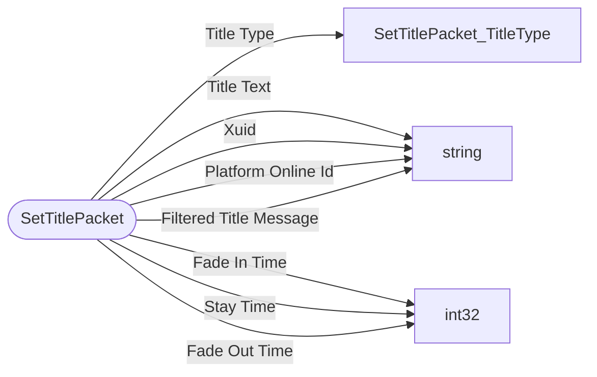

# SetTitlePacket

`packet` - id **88**

There are 2 commands associated with it: title and titleraw.
	Both of which have functionality to change fade in/out time for titles, sub titles, and action bar text.
	titleraw is using json to format so it will be bigger (i don't have an example)

