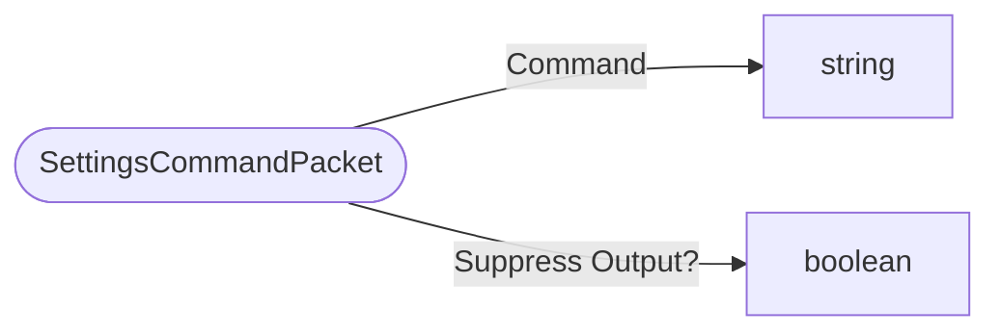

# SettingsCommandPacket

`packet` - id **140**

Used when the player changes the world settings like doDayNightCycle or WeatherCycle via the world settings menu

```mermaid
flowchart LR
  ROOT(["SettingsCommandPacket"])
  ROOT -->|"Command"| string["string"]
  ROOT -->|"Suppress Output?"| boolean["boolean"]
```

