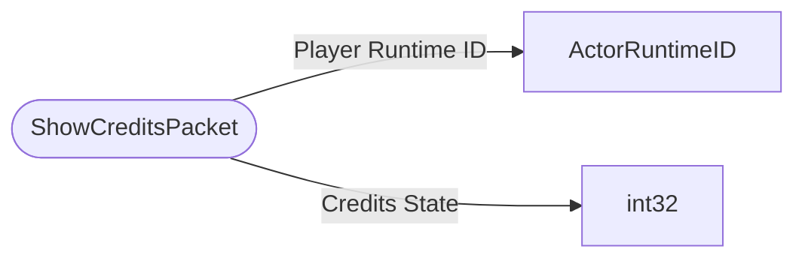

# ShowCreditsPacket

`packet` - id **75**

- protocol: 2168
- minecraft: 1.26.40

That packet is sent to the client.  When the credits have concluded, a packet is sent back to the server to let it know to reinstate the player watching the credits.

