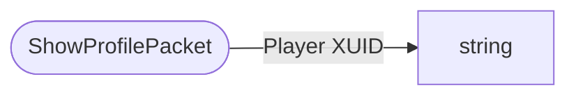

# ShowProfilePacket

`packet` - id **104**

The only use in vanilla is a test command called ProfileCommand. It makes the user's xbox profile popup.

```mermaid
flowchart LR
  ROOT(["ShowProfilePacket"])
  ROOT -->|"Player XUID"| string["string"]
```

