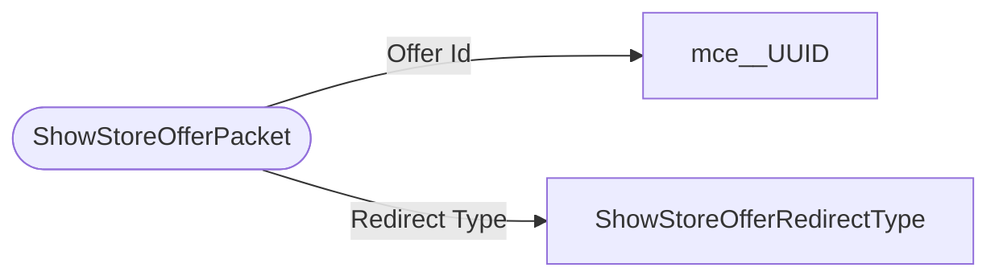

# ShowStoreOfferPacket

`packet` - id **91**

- protocol: 2168
- minecraft: 1.26.40

The server can redirect the user to a 3rd party server page, to a marketplace offer description page, or to a dressing room page containing desired offer.

