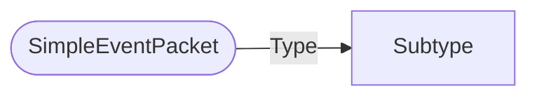

# SimpleEventPacket

`packet` - id **64**

This is fired from the client to the server and a SetCommandsEnabledPacket is sent back when enabling commands.

```mermaid
flowchart LR
  ROOT(["SimpleEventPacket"])
  ROOT -->|"Type"| Subtype["Subtype"]
```

