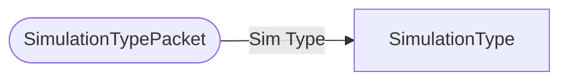

# SimulationTypePacket

`packet` - id **168**

- protocol: 2168
- minecraft: 1.26.40

- mSimType: an enum representing the simulation type to switch to.

```mermaid
flowchart LR
  ROOT(["SimulationTypePacket"])
  ROOT -->|"Sim Type"| SimulationType["SimulationType"]
```

