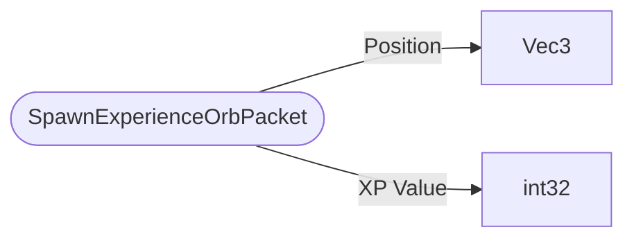

# SpawnExperienceOrbPacket

`packet` - id **66**

Note: This can be seen as "ContainerWantSetSlotPacket" when sent from client to server. Currently, the client handles side-effects relating to it's own inventory, regardless of the success of the operation.

