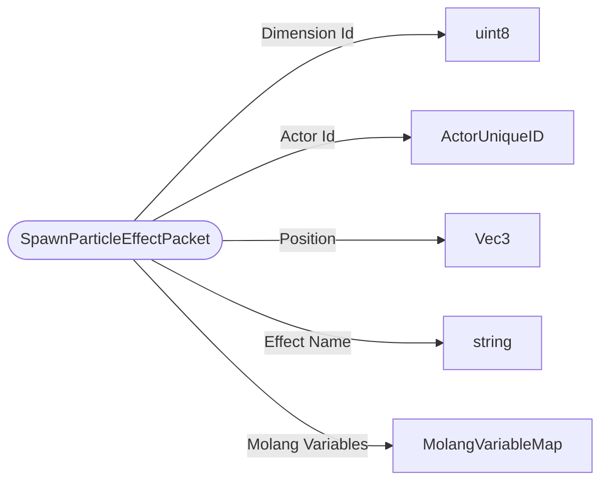

# SpawnParticleEffectPacket

`packet` - id **118**

This is not used for much anymore, only the Particle command (spawn particle by name at a location) and for ScriptServerSpawnParticleAttachedToActor and ScriptServerSpawnParticleInWorldEvent.

