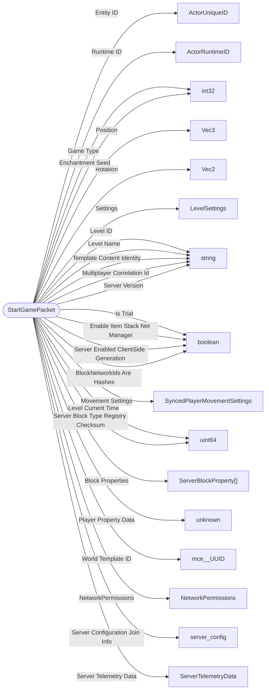

# StartGamePacket

`packet` - id **11**

- protocol: 2168
- minecraft: 1.26.40

The player movement mode is also specified here, see ServerAuthMovementMode enum documentation for details on the modes.

