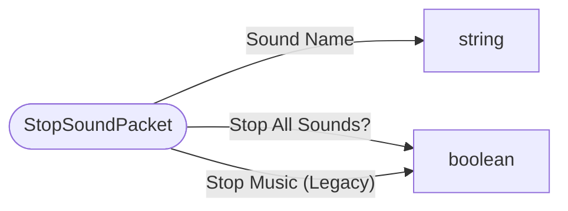

# StopSoundPacket

`packet` - id **87**

- protocol: 2168
- minecraft: 1.26.40

```mermaid
flowchart LR
  ROOT(["StopSoundPacket"])
  ROOT -->|"Sound Name"| string["string"]
  ROOT -->|"Stop All Sounds?"| boolean["boolean"]
  ROOT -->|"Stop Music (Legacy)"| boolean["boolean"]
```

