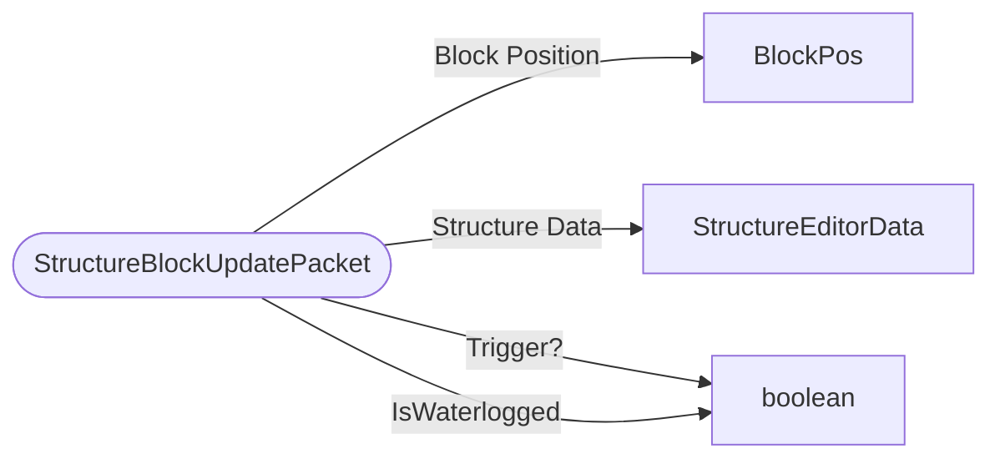

# StructureBlockUpdatePacket

`packet` - id **90**

- protocol: 2168
- minecraft: 1.26.40

```mermaid
flowchart LR
  ROOT(["StructureBlockUpdatePacket"])
  ROOT -->|"Block Position"| BlockPos["BlockPos"]
  ROOT -->|"Structure Data"| StructureEditorData["StructureEditorData"]
  ROOT -->|"Trigger?"| boolean["boolean"]
  ROOT -->|"IsWaterlogged"| boolean["boolean"]
```

