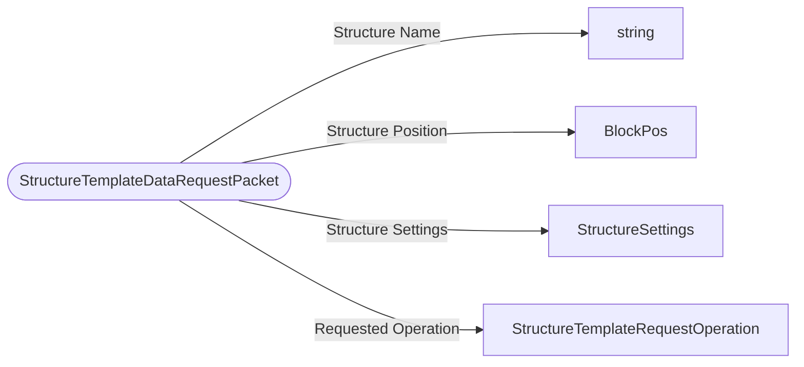

# StructureTemplateDataRequestPacket

`packet` - id **132**

- protocol: 2168
- minecraft: 1.26.40

This is used to kick off the process of loading and returning a structure in a Tag from the server back to the client. Currently this functionality is completely disabled and does nothing.

